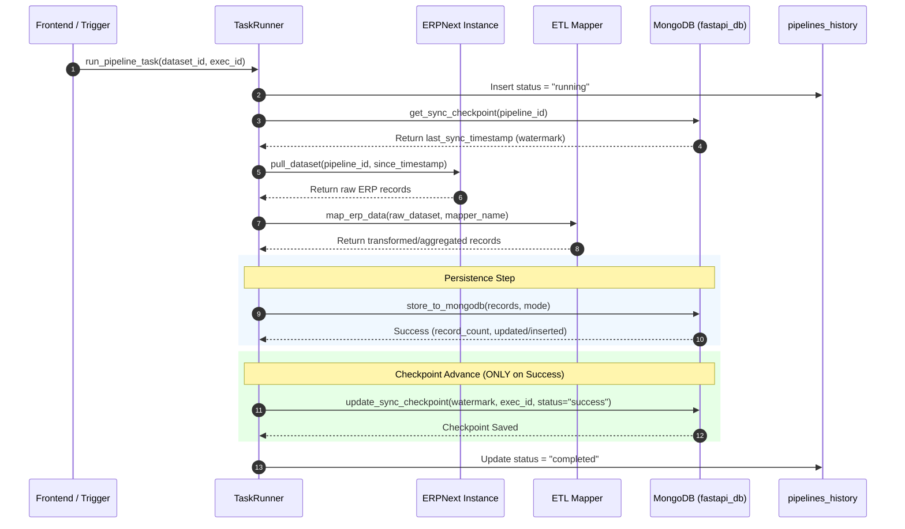
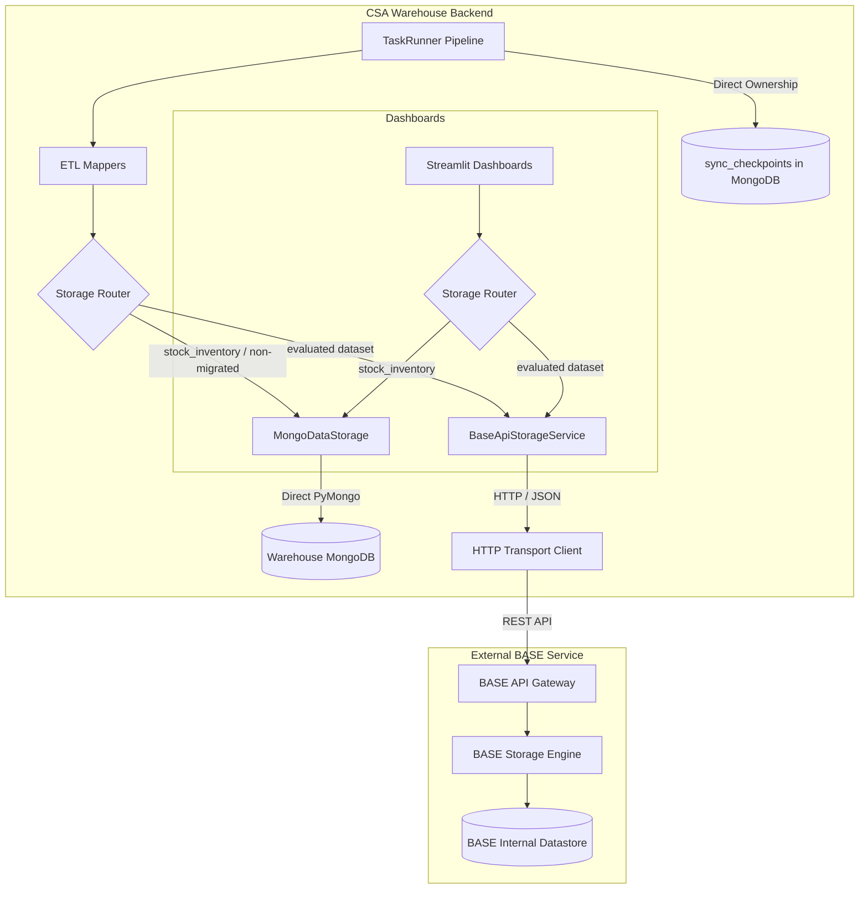
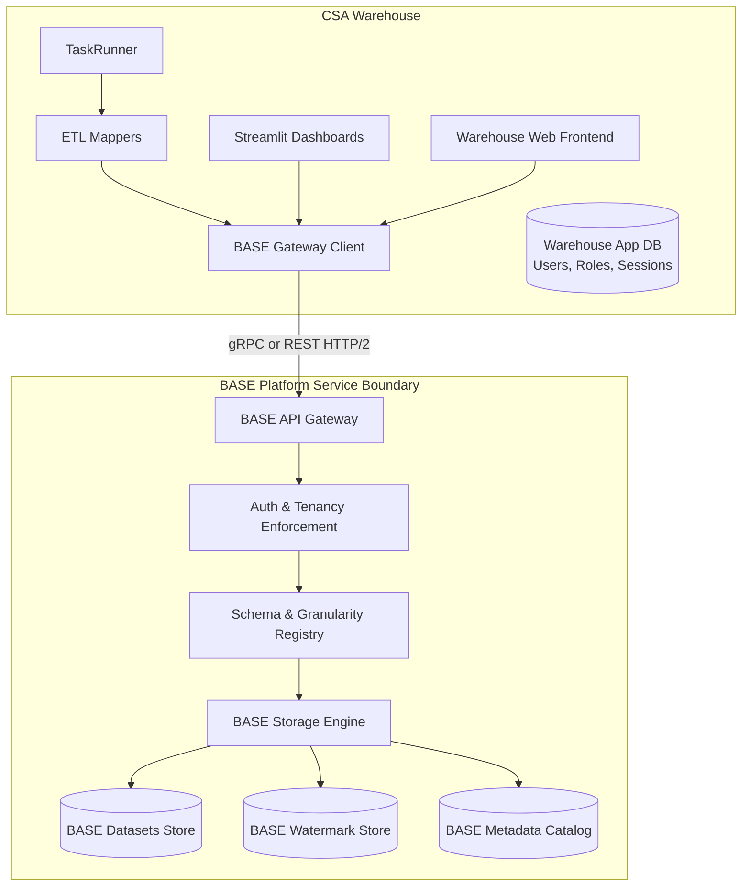
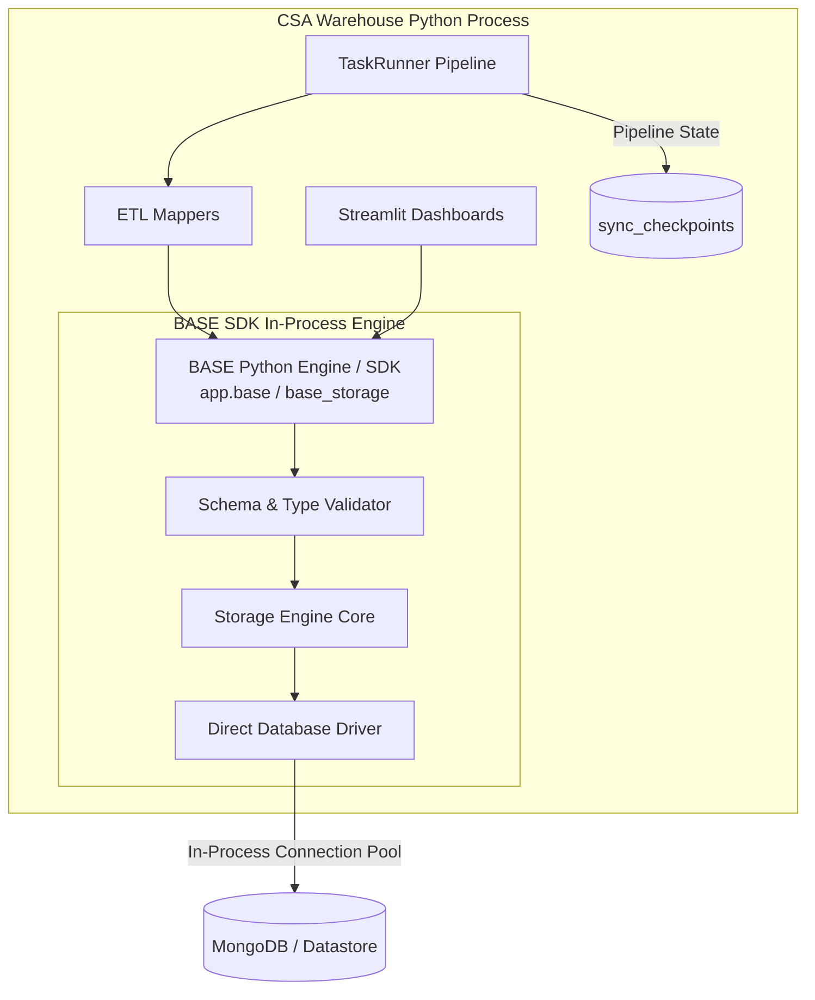

# BASE Architecture Options & Existing Prototype Audit

**Status**: Architectural Review & Decision Proposal (Point 14)  
**Target Audience**: Krishna (`rkrishnasanka`), CSA Architecture & Engineering Team  
**Date**: October 2026  
**Implementation State**: Strictly Read-Only (Zero Code Modifications)

---

## Executive Summary

Following the successful completion and verification of all 11 PR #22 review comments regarding canonical storage keys, pipeline status lifecycles, and RBAC centralization (**Point 13 complete**), this document executes **Point 14** of the CSA Warehouse architectural roadmap:

1. **Section 1: Contract Certainty Demarcation**: Formally separates *Confirmed Production Ground Truth*, *Proposed Prototype Patterns*, and *Unknown / Unconfirmed Specifications*.
2. **Section 2: Read-Only Prototype Audit**: Conducts a thorough 7-point audit across all seven files introduced in the prototype abstraction layer (`commit 922944f`).
3. **Section 3: Production Warehouse Baseline**: Details current pipeline execution paths, storage mechanisms, checkpoint invariants, and dashboard data consumers.
4. **Section 4: Three Alternative BASE Architecture Variants**: Details three distinct architectural options (Client-Side Pluggable Adapter, Remote Microservice Gateway, and Embedded In-Process Engine) across 13 consistent criteria.
5. **Section 5: Comparative Evaluation Matrix**: Compares all three variants side-by-side.
6. **Section 6: Decision Checklist for Krishna**: High-priority questions requiring Krishna's feedback before implementation.

> [!IMPORTANT]
> **Strict Constraints Upheld**:
> - Zero changes made to production code or existing working pipelines.
> - `stock_inventory` is strictly preserved on MongoDB and excluded from any BASE migration.
> - Checkpoint ownership and watermark advancing sequences remain unmodified.
> - No multi-granularity time/location metadata is forced onto datasets that do not require it.
> - No speculative BASE API routes are treated as confirmed contracts.

---

## 1. Architectural Certainty Matrix

To eliminate ambiguity, all aspects of the CSA Warehouse and BASE integration are categorized into three certainty tiers:

| Dimension | Confirmed (Production Ground Truth) | Proposed (Prototype / Candidate) | Unknown / Needs Krishna Confirmation |
| :--- | :--- | :--- | :--- |
| **Active Datastore** | MongoDB (`fastapi_db`) storing collections: `datasets`, `datasets_information`, `sync_checkpoints`, `pipelines`, `pipelines_history`. | Abstraction boundary (`BaseDataStorage`) decoupling PyMongo from application callers. | Whether BASE replaces MongoDB entirely, proxies it, or coexists alongside it. |
| **Pipeline Lifecycle** | `TaskRunner.run_pipeline_task` coordinates ERP pull -> mapping -> persistence -> checkpoint update -> status completion. | `MongoDataStorage` adapter encapsulating `store_to_mongodb`. | Whether BASE provides its own ingestion pipeline or only serves as a storage sink. |
| **Checkpoint Invariant** | Watermark advances in `sync_checkpoints` **only after** persistence succeeds. If persistence fails, status is `error` and watermark is unchanged. | Checkpoint retrieval and update methods exposed via `BaseDataStorage`. | Whether BASE maintains pipeline sync watermarks or if Warehouse owns checkpoints exclusively. |
| **Dataset Semantics** | `stock_inventory` & `stock_movement` are snapshot datasets (`mode="replace"`). `territory_transactions`, `nf_coordinator_activities`, `revenue_analysis`, `farmer_income_visits` are incremental (`mode="upsert"`). | Schema metadata distinguishing snapshot vs. incremental with optional temporal tags. | Does BASE support native upsert merges by identity key, or does it require full versioned snapshots? |
| **Dashboard Query Path** | 6 Streamlit dashboards query MongoDB via `load_dashboard_data_from_mongodb`, with fallback to local CSVs. | Dashboards query storage via `storage.fetch_dataset_df()`. | Will dashboards call BASE directly, through Warehouse backend API, or via direct DB reads? |
| **BASE Protocol** | None confirmed. | HTTP REST with JSON payloads and configurable headers. | HTTP REST, gRPC, WebSocket, or in-process Python library? |
| **BASE Endpoints** | None confirmed. | `/api/v1/datasets/save`, `/fetch`, `/merge`, `/checkpoints/{id}`. | Exact URL routes, HTTP methods, parameter naming, and pagination conventions. |
| **Authentication** | None confirmed for BASE. | Configurable Bearer token or API key header (`X-API-Key`). | Auth provider, JWT vs. API Key, token refresh lifecycle. |
| **Data Payload Format** | Internal records are `List[Dict[str, Any]]` or `pd.DataFrame`. | Wrapped envelope: `{"records": [...], "metadata": {...}}`. | Exact wire format, multipart upload for large datasets, compression (gzip/parquet). |
| **Spatial / Temporal** | Stored as plain flat fields (e.g. `district`, `date`). | Hierarchical enums (`SpatialGranularity`, `TemporalGranularity`). | Does BASE require explicit spatial/temporal metadata registration, or infer it from columns? |

---

## 2. Read-Only Prototype Audit of Existing BASE Code

In `commit 922944f`, seven files were introduced to prototype an architectural abstraction layer. Below is the systematic audit of each file.

```
Existing Prototype Files:
├── backend/app/schemas/base_schema.py
├── backend/app/config/base_config.py
├── backend/app/services/storage/base_data_storage.py
├── backend/app/services/storage/base_api_storage_service.py
├── backend/app/services/storage/mongo_data_storage.py
├── backend/app/services/storage/data_storage_factory.py
└── backend/tests/test_base_storage_architecture.py
```

---

### File 1: `backend/app/schemas/base_schema.py`

#### 1. Current Responsibility
Defines Pydantic models for spatial granularity (`SpatialGranularity`: country, state, district, city, admin division, GPS), temporal granularity (`TemporalGranularity`: year, month, day, hour, minute, second, range), column schemas (`ColumnSchema`), dataset metadata (`DatasetSchemaMetadata`), operation requests (`SaveDatasetRequest`, `FetchDatasetRequest`, `MergeDatasetRequest`), operation responses (`StorageResponse`), and checkpoint watermarks (`CheckpointData`).

#### 2. Why It Exists
Created to formalize data structures and type contracts for dataset storage operations and metadata definitions based on Krishna's conceptual architecture diagrams.

#### 3. Whether It Matches Krishna's Requirements
- **Partially matches**: Krishna requested centralized, schema-aware dataset management with spatial and temporal awareness.
- **Divergence**: Krishna explicitly warned against over-engineering schemas, imposing rigid multi-granularity hierarchies on datasets that do not need them, or inventing unconfirmed request/response payloads. While this file marked spatial/temporal info as optional (`is_spatial: bool = False`), the multi-level hierarchies are unused by any active operational dataset.

#### 4. Whether It Is Actually Needed
- **Largely speculative at this stage**. The six operational datasets in the warehouse have flat operational schemas (e.g., coordinator activities, purchase invoices, inventory balances). Hierarchical spatial/temporal models and `MergeDatasetRequest` join strategies (`spatial_join`, `temporal_join`) are unnecessary for warehouse ingestion and dashboard consumption today.

#### 5. Assumptions Not Confirmed by Krishna/BASE
- Assumes BASE requires a custom envelope (`SaveDatasetRequest` wrapping `records`, `identity_key`, `mode`, `metadata`).
- Assumes BASE exposes a `/merge` endpoint supporting spatial and temporal resolutions.
- Assumes BASE manages pipeline checkpoint watermarks via `CheckpointData`.
- Assumes spatial and temporal taxonomy matches fixed string enums.

#### 6. Duplication of Existing Warehouse Functionality
- Duplicates models in `backend/app/schemas/models.py` (`DatasetCreate`, `DatasetInformation`, `PipelineItem`).
- Duplicates fields already persisted in MongoDB collection `datasets_information` (`is_spatial`, `is_temporal`, `location_columns`, `time_columns`).

#### 7. Future Recommendation: **Simplify & Redesign**
- Remove speculative spatial/temporal join models and `MergeDatasetRequest`.
- Retain only minimal data-transfer objects (DTOs) for dataset records and simple query filters.
- Re-introduce domain-specific metadata models only when a dataset with explicit geographic or temporal hierarchy requirements is onboarded.

---

### File 2: `backend/app/config/base_config.py`

#### 1. Current Responsibility
Defines `BaseStorageConfig` via Pydantic `BaseSettings` reading environment variables for `DATA_STORAGE_BACKEND` (defaulting to `"mongodb"`), `BASE_API_URL`, `BASE_TRANSPORT`, `BASE_AUTH_TYPE`, network timeouts (`timeout_seconds=15.0`, `connect_timeout_seconds=5.0`), retries, and five endpoint path templates.

#### 2. Why It Exists
To make BASE connection parameters, authentication credentials, and routes configurable via environment variables, avoiding hardcoded URLs in compliance with Krishna's PR review feedback.

#### 3. Whether It Matches Krishna's Requirements
- **Matches**: Defaults safely to `"mongodb"` to guarantee zero regression on existing pipelines.
- **Matches**: Bounded timeouts prevent pipeline hanging.
- **Divergence**: Five configurable endpoint templates were invented to avoid hardcoding routes, but this adds configuration surface area for endpoints that are not yet designed.

#### 4. Whether It Is Actually Needed
- **Conditionally needed**. If BASE is deployed as a remote HTTP microservice, connection URLs, auth headers, and timeout settings are mandatory. If BASE is an in-process Python library (Variant 3), this entire HTTP network configuration is redundant.

#### 5. Assumptions Not Confirmed by Krishna/BASE
- Assumes BASE is an HTTP service requiring URL endpoints.
- Assumes BASE uses Bearer token or `X-API-Key` authentication.
- Assumes operations map to individual endpoints: save, fetch, merge, checkpoint get, and checkpoint update.

#### 6. Duplication of Existing Warehouse Functionality
- Partially overlaps with `backend/app/config/settings.py` (which houses global settings, MongoDB URI, AWS/MinIO credentials).

#### 7. Future Recommendation: **Keep & Simplify**
- If an HTTP microservice architecture is selected, collapse this into standard settings with `BASE_API_URL`, `BASE_API_KEY`, and timeouts. Remove the five endpoint templates once the real BASE API route structure is specified.
- If an in-process library architecture is selected, remove this file entirely.

---

### File 3: `backend/app/services/storage/base_data_storage.py`

#### 1. Current Responsibility
Defines the abstract interface `BaseDataStorage` with abstract methods: `save_dataset`, `fetch_dataset`, `merge_dataset`, `get_checkpoint`, `update_checkpoint`, plus a concrete helper `fetch_dataset_df`. Defines custom exception classes: `BaseStorageError`, `BaseConnectionError`, `BaseTimeoutError`, `BaseAuthenticationError`, and `BaseDataValidationError`.

#### 2. Why It Exists
Provides a dependency inversion boundary so Warehouse pipelines and dashboards can interact with storage abstractions rather than binding directly to PyMongo or concrete HTTP clients.

#### 3. Whether It Matches Krishna's Requirements
- **Matches**: Decouples application logic from raw database calls.
- **Matches**: Custom exceptions enforce explicit error bubbling without silent failures.
- **Divergence**: Includes `merge_dataset` (which belongs in the ERP mapper / ETL layer, not storage) and couples checkpoint watermark management to dataset storage.

#### 4. Whether It Is Actually Needed
- **Needed in concept, but currently over-specified**. An abstract interface for reading and writing datasets is beneficial for testability and pluggability. However, checkpoint tracking is an operational pipeline responsibility, not a generic datastore responsibility.

#### 5. Assumptions Not Confirmed by Krishna/BASE
- Assumes the underlying storage engine must handle record merging internally rather than receiving pre-merged/mapped records from the ETL layer.
- Assumes BASE manages pipeline execution watermarks.

#### 6. Duplication of Existing Warehouse Functionality
- Abstracts operations currently executed directly in `mongodb_service.py` (`store_to_mongodb`, `get_sync_checkpoint`, `update_sync_checkpoint`) and `utilities.py` (`load_dashboard_data_from_mongodb`).

#### 7. Future Recommendation: **Redesign & Streamline**
- Narrow the interface strictly to dataset persistence and retrieval:
  - `save_dataset(dataset_name, records, mode)`
  - `fetch_dataset(dataset_name, filters)`
  - `fetch_dataset_df(dataset_name, filters)`
- Strip out `merge_dataset` (keep mapping in `app/mappings/`).
- Decouple checkpoint persistence so `TaskRunner` retains pipeline execution state separately.

---

### File 4: `backend/app/services/storage/base_api_storage_service.py`

#### 1. Current Responsibility
Implements `BaseDataStorage` by dispatching requests to a transport client (`HttpBaseTransportClient` using `requests.Session` or `MockBaseTransportClient`). Enforces bounded timeouts, serializes JSON payloads, and translates HTTP/network errors into `BaseStorageError` subclasses with strict failure bubbling (no silent MongoDB fallback).

#### 2. Why It Exists
Acts as the client adapter to communicate with an external BASE REST API server when `DATA_STORAGE_BACKEND="base"`.

#### 3. Whether It Matches Krishna's Requirements
- **Matches**: Enforces the invariant: **zero silent fallback to MongoDB** on BASE failure. If BASE times out or errors, it fails loudly so `TaskRunner` records the execution as `"error"` and freezes the checkpoint.
- **Divergence**: Every HTTP endpoint route and request envelope implemented is speculative because no BASE service specification exists yet.

#### 4. Whether It Is Actually Needed
- **Not needed today**. There is no live BASE service running, no confirmed endpoint contract, and no migrated dataset. It is currently exercised solely by unit tests via its internal `MockBaseTransportClient`.

#### 5. Assumptions Not Confirmed by Krishna/BASE
- Assumes BASE communicates via HTTP REST JSON.
- Assumes fetch operations use `POST /api/v1/datasets/fetch` with a JSON filter body.
- Assumes BASE returns JSON envelopes containing a `"data"` or `"records"` key.
- Assumes BASE exposes checkpoint watermark endpoints.

#### 6. Duplication of Existing Warehouse Functionality
- Attempts to replicate all MongoDB dataset and checkpoint operations over HTTP.

#### 7. Future Recommendation: **Freeze as Prototype / Redesign Upon API Contract**
- Do not connect to production pipelines.
- Keep as an architectural reference for HTTP client communication.
- When Krishna and the BASE team provide the actual OpenAPI/Swagger contract or Python SDK, rewrite or replace this adapter to match the actual specification.

---

### File 5: `backend/app/services/storage/mongo_data_storage.py`

#### 1. Current Responsibility
Implements `BaseDataStorage` by delegating to existing, verified MongoDB functions in `mongodb_service.py`. Uses deferred/lazy imports inside methods to prevent premature `MongoClient` initialization at import time. Implements in-memory filtering, column projection, and pagination via `_apply_filters_and_slices`.

#### 2. Why It Exists
Serves as a backward-compatible adapter ensuring that code programmed against the `BaseDataStorage` interface can operate seamlessly against existing MongoDB collections (`datasets`, `datasets_information`, `sync_checkpoints`).

#### 3. Whether It Matches Krishna's Requirements
- **Matches**: Preserves existing MongoDB collection schemas, pipeline tracking, and checkpoint semantics with zero changes to underlying data.
- **Matches**: Deferred imports protect against connection side effects during test runs or module loading.

#### 4. Whether It Is Actually Needed
- **Currently unused by production code**. Production pipelines call `store_to_mongodb` directly, and dashboards call `load_dashboard_data_from_mongodb`. `MongoDataStorage` is only invoked in unit tests.
- However, if the Warehouse adopts an adapter pattern (Variant 1), this class provides the working MongoDB implementation.

#### 5. Assumptions Not Confirmed by Krishna/BASE
- Implements in-memory slicing and filtering on retrieved records (`_apply_filters_and_slices`), which behaves differently from native MongoDB query engine filtering.

#### 6. Duplication of Existing Warehouse Functionality
- Directly duplicates data retrieval and lookup routines from `load_dashboard_data_from_mongodb` (`utilities.py`) and `get_data_from_collection` (`mongodb_service.py`).

#### 7. Future Recommendation: **Keep as Transition Adapter**
- If Variant 1 (pluggable adapter) is approved, keep this class as the default MongoDB adapter.
- Consolidate the duplicate MongoDB retrieval paths so both `load_dashboard_data_from_mongodb` and `fetch_dataset` use a single shared query function.

---

### File 6: `backend/app/services/storage/data_storage_factory.py`

#### 1. Current Responsibility
Provides a factory function `get_data_storage(storage_backend: Optional[str] = None)` that returns either `MongoDataStorage` (default) or `BaseApiStorageService` based on the `DATA_STORAGE_BACKEND` environment variable, using lazy imports.

#### 2. Why It Exists
Enables dynamic switching between storage backends via configuration without modifying application call sites.

#### 3. Whether It Matches Krishna's Requirements
- **Matches**: Defaults safely to `"mongodb"`, guaranteeing zero inadvertent activation of unverified BASE code.

#### 4. Whether It Is Actually Needed
- **Currently unused by production pipelines or dashboards**. Only referenced in `test_base_storage_architecture.py`.

#### 5. Assumptions Not Confirmed by Krishna/BASE
- Assumes a global, binary toggle (`DATA_STORAGE_BACKEND = "mongodb" | "base"`). In reality, migration is incremental: certain datasets may migrate to BASE while others (such as `stock_inventory`) remain permanently on MongoDB. A global binary toggle cannot handle dataset-by-dataset routing.

#### 6. Duplication of Existing Warehouse Functionality
- Mirrors the pattern used in `app/services/storage/storage_factory.py` (which routes MinIO vs. AWS S3).

#### 7. Future Recommendation: **Redesign for Granular Dataset Routing**
- Upgrade the factory from a single global backend switch to a dataset/pipeline-aware router:
  ```python
  def get_data_storage(dataset_name: Optional[str] = None) -> BaseDataStorage:
      # e.g., if dataset_name == "stock_inventory": return MongoDataStorage()
  ```

---

### File 7: `backend/tests/test_base_storage_architecture.py`

#### 1. Current Responsibility
Executes 13 unit tests verifying:
- Schema optionality (spatial and temporal metadata can be omitted without error).
- Interface enforcement (cannot instantiate `BaseDataStorage` directly).
- `BaseApiStorageService` operations against `MockBaseTransportClient`.
- Strict failure bubbling (verifying `BaseConnectionError` and `BaseTimeoutError` are raised and not swallowed).
- Default factory resolution to `MongoDataStorage`.
- `MongoDataStorage` contract compliance.

#### 2. Why It Exists
Provides automated validation for the prototype classes and guarantees that architectural constraints (such as the no-silent-fallback rule) are enforced.

#### 3. Whether It Matches Krishna's Requirements
- **Matches**: Placed cleanly under `backend/tests/` without polluting the workspace root, directly addressing Krishna's PR review comment.
- **Matches**: Verifies the strict failure visibility invariant.

#### 4. Whether It Is Actually Needed
- **Needed** to ensure prototype classes do not break when touched and to validate mock transport behavior (all 13 tests currently pass).

#### 5. Assumptions Not Confirmed by Krishna/BASE
- Validates mock behavior that mirrors the speculative endpoint and schema assumptions of `base_api_storage_service.py` and `base_schema.py`.

#### 6. Duplication of Existing Warehouse Functionality
- Does not duplicate existing tests; complements `test_phase2_storage_sync.py` and `test_pipeline_compatibility.py`.

#### 7. Future Recommendation: **Keep & Refactor with Architecture Selection**
- Keep the test suite. Once an architecture variant and real contract are agreed upon with Krishna, refactor the tests to validate the selected contract.

---

## 3. Existing Warehouse Storage & Pipeline Baseline

The existing CSA Warehouse pipeline is fully operational. To ensure zero regression, any proposed BASE architecture must integrate around these proven patterns.

### 3.1 Pipeline Execution & Checkpoint Sequencing Invariant

The core data ingestion workflow is executed by `TaskRunner.run_pipeline_task` in `backend/app/services/tasks/task_executor.py`:



#### The Critical Checkpoint Invariant
1. Watermark timestamps in `sync_checkpoints` are **strictly advanced after successful persistence**.
2. If `pull_dataset`, `map_erp_data`, or `store_to_mongodb` throws an exception:
   - Catch block records execution status as `"error"` in `pipelines_history` with the exact error message.
   - `update_sync_checkpoint` is **bypassed**.
   - The watermark remains frozen at the previous successful sync time, ensuring that the next run re-fetches missed records.

### 3.2 Current Dataset Semantics Matrix

The CSA Warehouse operates six production dashboard datasets:

| Pipeline / Dataset ID | ERP Source Instance | ERP DocType / Report | Source Type | Sync Strategy | Identity Key | Operational Nature | Migration Eligibility |
| :--- | :--- | :--- | :--- | :--- | :--- | :--- | :--- |
| **`stock_inventory`** | `erp.fpohub.com` | `Stock Balance` | `query_report` | `snapshot` | *None* | Point-in-time warehouse balance | **STRICTLY EXCLUDED (Do Not Migrate)** |
| **`stock_movement`** | `erp.fpohub.com` | `Stock Balance` | `query_report` | `snapshot` | *None* | Periodic stock inflow/outflow balance | Candidate for Snapshot Evaluation |
| **`territory_transactions`** | `erp.fpohub.com` | `Purchase Invoice` | `doctype` | `timestamp` | `date` | Procurement transactions | Candidate for Incremental Evaluation |
| **`nf_coordinator_activities`** | `erp.csa-india.org` | `CC Daily Reports` | `doctype` | `timestamp` | `date` | Field visits & farmer meetings | Candidate for Incremental Evaluation |
| **`farmer_income_visits`** | `erp.csa-india.org` | `CC Daily Reports` | `doctype` | `timestamp` | `coordinator_name` | Monthly coordinator visit scores | Candidate for Incremental Evaluation |
| **`revenue_analysis`** | `erp.fpohub.com` | `Purchase Invoice` | `doctype` | `timestamp` | `territory` | Monthly procurement revenue | Candidate for Incremental Evaluation |

### 3.3 Dashboard Read Path
All six Streamlit dashboards load data via `load_dashboard_data_from_mongodb` in `backend/app/dashboards/utilities.py`:
1. Queries `fastapi_db[collection_name]`.
2. If empty, queries `datasets_information` -> `datasets` collection by `_id`.
3. If still empty, falls back gracefully to a static local CSV file in `app/dashboards/data/`.
4. Auto-sync is explicitly disabled (`auto_sync=False`) on `stock_inventory` and `stock_movement` to preserve interactive dashboard speed.

---

## 4. Three Alternative BASE Architecture Variants

We present three distinct architectural variants for integrating BASE into the CSA Warehouse. Each variant represents a fundamentally different deployment and integration philosophy.

---

### Variant 1: Client-Side Pluggable Adapter (Configurable Engine)

**Core Concept**: The Warehouse retains full architectural autonomy. An application-level interface (`BaseDataStorage`) lives inside the Warehouse backend. Both `MongoDataStorage` and `BaseApiStorageService` exist as client adapters. Datasets are routed dynamically (e.g., `stock_inventory` routes to MongoDB, while evaluated datasets route to BASE via HTTP).

#### Architecture Diagram


#### Detailed Specification
- **Write Path**: `TaskRunner` pulls ERP data and applies mappers -> calls `router.get_storage(dataset_id).save_dataset(records, mode)` -> For BASE-routed datasets, `BaseApiStorageService` sends an HTTP POST to BASE -> On HTTP 200/201 acknowledgment, `TaskRunner` receives success response -> `TaskRunner` updates `sync_checkpoints` in MongoDB -> Marks execution `"completed"`.
- **Dashboard Read Path**: Streamlit dashboard calls `router.get_storage(dataset_id).fetch_dataset_df()` -> `BaseApiStorageService` performs HTTP GET/POST to BASE -> Deserializes JSON into `pd.DataFrame`. Non-migrated datasets read directly from MongoDB.
- **BASE Responsibility**: Remote persistence, indexing, and serving of migrated datasets via REST API.
- **Warehouse Responsibility**: Ingestion orchestration, ERP authentication, data mapping, checkpoint sequencing, failure management, dashboard rendering, and storage routing.
- **MongoDB Ownership**: Warehouse exclusively owns its local MongoDB instance (`fastapi_db`). BASE owns whatever internal datastore it uses.
- **Checkpoint Ownership**: Strictly **Warehouse-owned in MongoDB** (`sync_checkpoints`). Checkpoint advances only after BASE acknowledges persistence.
- **Snapshot Semantics**: Handled by passing `mode="replace"` in `save_dataset`. BASE replaces the record set for that dataset identifier.
- **Failure Behavior**: Strict error bubbling. If BASE HTTP call fails or times out, `BaseApiStorageService` raises `BaseStorageError`. `TaskRunner` catches it, sets execution status to `"error"`, and skips checkpoint updating. **Zero silent fallback to MongoDB**.
- **Function-Call vs. HTTP Behavior**: In-process Python calls within the Warehouse codebase; HTTP/REST network calls across the boundary between Warehouse and BASE.
- **Migration Impact**: Minimal risk. Granular, dataset-by-dataset migration. `stock_inventory` remains permanently on MongoDB. Non-migrated pipelines are untouched.
- **Advantages**:
  - Safest, most incremental migration path.
  - Zero regression risk for un-migrated datasets.
  - Isolated testing using mock transport clients.
  - Checkpoint integrity remains 100% under Warehouse control.
- **Disadvantages**:
  - Warehouse maintains dual storage adapter codebases.
  - HTTP network serialization overhead on dashboard queries.
- **Risks**: Network latency between Warehouse and BASE could slow dashboard loading if caching is not used.

---

### Variant 2: Remote Microservice Gateway (BASE as Central Data Service)

**Core Concept**: BASE is an authoritative, standalone microservice gateway. The Warehouse acts purely as an ingestion client (ETL) and visualization consumer. MongoDB in the Warehouse is decommissioned for dataset storage and relegated strictly to user/auth/session storage. All analytical datasets, checkpoints, and catalog metadata are managed by BASE.

#### Architecture Diagram


#### Detailed Specification
- **Write Path**: `TaskRunner` pulls ERP data and applies mappers -> Calls BASE Client `base_client.ingest_dataset(name, records, watermark, execution_id)` -> BASE service handles dataset persistence, schema validation, and atomic watermark recording inside its own boundary -> Returns unified transaction receipt -> `TaskRunner` marks execution `"completed"`.
- **Dashboard Read Path**: Streamlit dashboard calls `base_client.query_dataset(name, filters)` -> BASE Gateway executes query, applies push-down projections/filters -> Returns compressed stream -> Dashboard renders Plotly visualizer.
- **BASE Responsibility**: Complete end-to-end lifecycle of datasets: storage, schema validation, versioning, indexing, spatial/temporal metadata resolution, and query optimization.
- **Warehouse Responsibility**: Data ingestion triggers, ERP connectors, business-specific ETL mapping, user authentication, UI/Dashboard presentation.
- **MongoDB Ownership**: Warehouse only maintains an application database for users, roles, and UI configuration. BASE owns the database storing dataset records and checkpoints.
- **Checkpoint Ownership**: **BASE-owned**. The checkpoint watermark is committed inside the same transaction or boundary as the dataset write in BASE.
- **Snapshot Semantics**: BASE natively supports immutable, versioned snapshots (e.g. `snapshot_id`, `version="latest"`).
- **Failure Behavior**: BASE returns formal HTTP/gRPC error codes (e.g., 422 Unprocessable Entity, 500 Storage Failed). Warehouse pipeline fails immediately and flags the run as `"error"`.
- **Function-Call vs. HTTP Behavior**: Strictly remote network communication (HTTP/REST or gRPC) across a container/network boundary.
- **Migration Impact**: High impact. Requires migrating all dataset storage, checkpoint state, and dashboard query routines to the BASE API.
- **Advantages**:
  - Complete architectural separation of concerns.
  - Centralized schema governance and spatial/temporal indexing in BASE.
  - Warehouse backend becomes extremely lightweight.
- **Disadvantages**:
  - High operational complexity (requires deploying, securing, and maintaining a separate service).
  - Tightly couples Warehouse ingestion to BASE availability.
  - Major migration overhead.
- **Risks**:
  - If the BASE service is delayed or API contracts change, Warehouse delivery stalls.
  - `stock_inventory` constraint requires either maintaining a legacy Mongo path anyway, or negotiating with Krishna.

---

### Variant 3: Embedded In-Process Storage Engine (BASE as a Python Library)

**Core Concept**: BASE is distributed not as a separate HTTP microservice, but as a **versioned Python package / SDK** (`import base_storage` or an internal package `app.base`). It executes in-process within the Warehouse Python runtime, directly accessing the configured database (MongoDB, DuckDB, or SQLite).

#### Architecture Diagram


#### Detailed Specification
- **Write Path**: `TaskRunner` pulls ERP data and applies mappers -> Calls `base_engine.write_dataset(dataset_name, dataframe_or_records, mode="snapshot"|"upsert")` as a direct Python function call -> BASE engine validates schema, formats documents, and writes to MongoDB using an optimized connection pool -> Returns execution summary -> `TaskRunner` calls `update_sync_checkpoint()` -> Marks execution `"completed"`.
- **Dashboard Read Path**: Streamlit dashboard calls `base_engine.read_dataset_df(dataset_name, filters)` -> In-process execution fetches records directly into a `pd.DataFrame` -> Zero HTTP serialization, zero network hops!
- **BASE Responsibility**: Providing standardized, reusable Python classes for schema validation, storage operations, and spatial/temporal querying that can be shared across multiple projects.
- **Warehouse Responsibility**: Hosting the runtime, running pipeline threads, managing ERP credentials, scheduling tasks, rendering dashboards.
- **MongoDB Ownership**: Shared connection string. The BASE library connects to MongoDB using the URI supplied by the Warehouse environment.
- **Checkpoint Ownership**: **Warehouse-owned**. `TaskRunner` maintains `sync_checkpoints` directly or via a lightweight helper.
- **Snapshot Semantics**: Handled in-process via bulk collection replace or atomic collection swapping (`$out` / rename).
- **Failure Behavior**: Native Python exceptions (`BaseStorageException`) raised directly in the call stack. Caught by `TaskRunner`'s `try/except` block with full traceback. No connection timeouts or partial network drops.
- **Function-Call vs. HTTP Behavior**: **100% in-process function calls**. Zero network/HTTP overhead.
- **Migration Impact**: Low to moderate. No microservice to deploy or monitor. Code refactoring is confined to internal function calls.
- **Advantages**:
  - **Highest performance**: Sub-millisecond latency for dashboard queries; zero JSON serialization overhead.
  - **Simplest operational footprint**: Single deployable container; no inter-service networking, service discovery, or API gateway.
  - **Direct debugging**: Full Python stack traces without distributed tracing tools.
  - Checkpoint sequencing is trivial to coordinate.
- **Disadvantages**:
  - Couples BASE to Python; other services written in Go or Node cannot use BASE without reimplementation or an API wrapper.
  - Dependency conflicts between Warehouse and BASE packages must be managed in `pyproject.toml`.
- **Risks**: Package version incompatibilities; tight runtime coupling.

---

## 5. Side-by-Side Comparison Matrix

| Evaluation Dimension | Variant 1: Client-Side Pluggable Adapter | Variant 2: Remote Microservice Gateway | Variant 3: Embedded In-Process Library |
| :--- | :--- | :--- | :--- |
| **Deployment Footprint** | Low (Warehouse + existing MongoDB; external BASE added when ready) | High (Warehouse + BASE Microservice + BASE DB + API Gateway) | **Lowest** (Single Warehouse container running Python SDK) |
| **Dashboard Query Latency** | Medium (HTTP serialization + wire transit) | Medium-High (Remote network hops + serialization) | **Lowest (< 5ms in-process DataFrame return)** |
| **Checkpoint Safety** | **High** (TaskRunner owns checkpoints in MongoDB) | High (BASE coordinates atomic transaction) | **Highest** (Native in-process call stack coordination) |
| **Failure Blast Radius** | Isolated (BASE failure affects only BASE datasets) | Broad (BASE downtime blocks all analytical queries) | Isolated (In-process exception handling) |
| **Operational Complexity** | Medium | High | **Low** |
| **Development Velocity** | **High** (Can prototype with mocks; no external blocker) | Low (Blocked until BASE team delivers running service) | **High** (Immediate local development and testing) |
| **Schema & Granularity** | Flexible (Datasets supply only relevant fields) | Rigid (Enforced centrally by BASE Gateway) | Flexible (Configured via Python classes) |
| **Regression Risk on Existing Code** | **Lowest** (Existing pipelines and Mongo paths untouched) | High (Requires rewriting query and write paths) | Low (Refactors internal service calls) |
| **Compliance with `stock_inventory` Constraint** | **100%** (`stock_inventory` stays on MongoAdapter) | Complex (Requires special bypass or exceptions) | **100%** (`stock_inventory` uses direct Mongo driver) |

---

## 6. Actionable Decision Checklist for Krishna

Before finalizing the architecture or beginning implementation, the following targeted questions must be discussed and decided with Krishna:

1. **Deployment Architecture Choice**:
   - Which variant best matches the long-term vision for BASE?
     - **Variant 1**: Client-side pluggable adapter (recommended for immediate safety and incremental rollout)?
     - **Variant 2**: Dedicated remote microservice gateway?
     - **Variant 3**: Embedded in-process shared Python library?
2. **BASE Protocol & Interface Delivery**:
   - If Variant 1 or 2 is preferred: Will BASE provide an OpenAPI / Swagger REST specification, a gRPC protobuf definition, or an official Python client SDK (`pip install base-client`)?
3. **Checkpoint & Watermark Ownership**:
   - Does Krishna agree that the **Warehouse `TaskRunner` must strictly retain checkpoint sequencing ownership** in `sync_checkpoints`, advancing watermarks only after the datastore confirms persistence?
4. **Dataset Scope & Snapshot Semantics**:
   - We confirm that **`stock_inventory` will NOT be migrated** to BASE.
   - For other operational datasets evaluated as candidates (e.g. `stock_movement`), does Krishna approve evaluating them under **snapshot semantics** (full point-in-time replacement) rather than complex delta merges?
5. **Spatial & Temporal Granularity Scope**:
   - Does Krishna agree to **defer multi-granularity geographic and temporal metadata models** (country -> GPS, year -> second) until a dataset specifically requires that hierarchy, keeping current operational datasets flat and lightweight?
6. **Dashboard Query Strategy**:
   - Should Streamlit dashboards query BASE directly via the client adapter, or should queries route through Warehouse FastAPI backend endpoints?
7. **Failure Policy Confirmation**:
   - Confirm that the **no-silent-fallback policy** is accepted: if BASE fails, the pipeline must log an explicit error and stop, rather than silently writing to MongoDB behind the scenes.

---

*End of Document. Awaiting Krishna's feedback on the 3 variants.*
